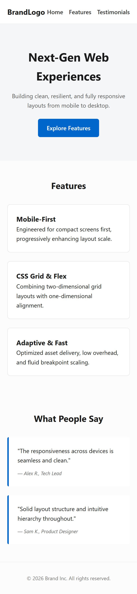
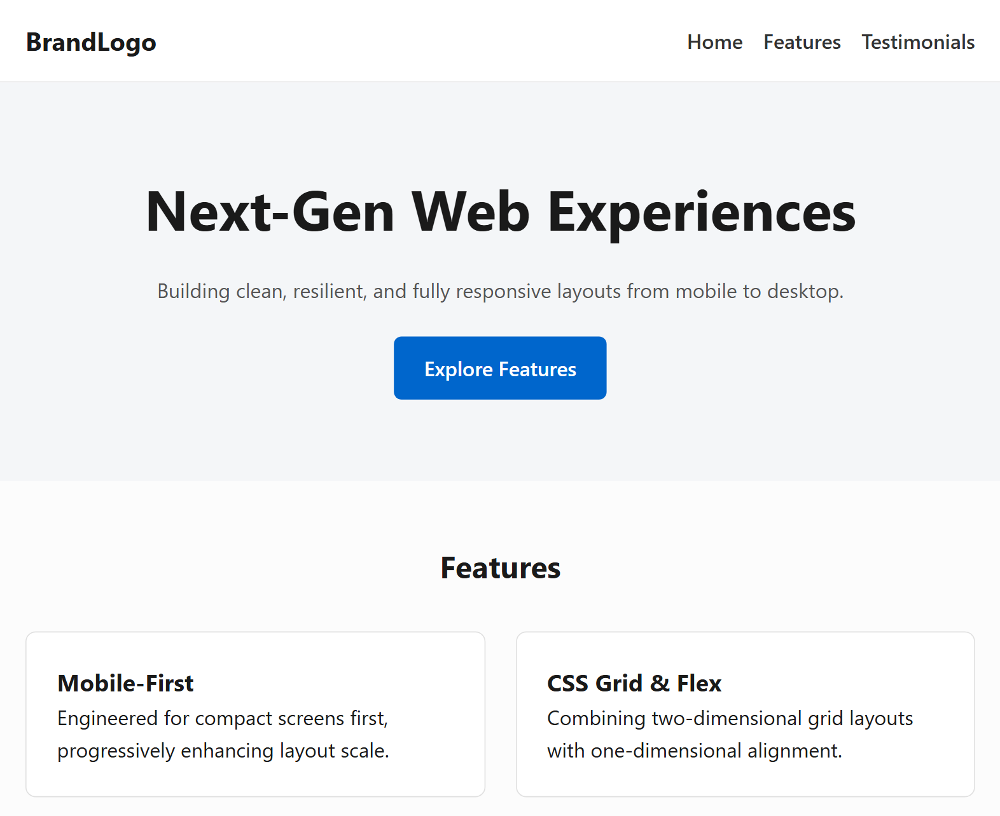
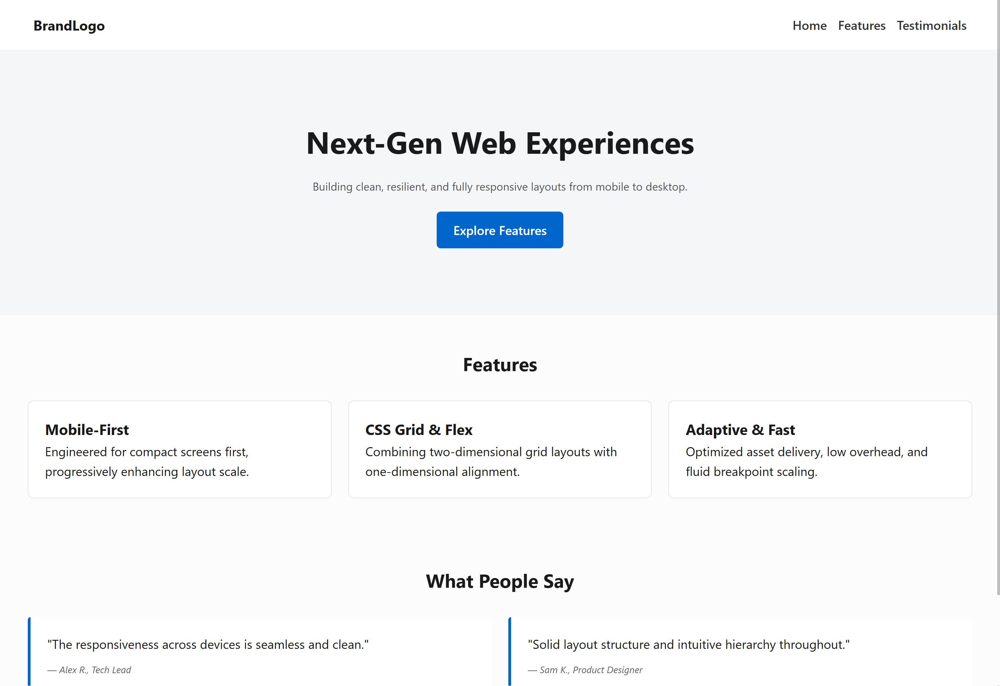

# Responsive Landing Page (Week 2 - Day 2)

A mobile-first, 4-section responsive landing page built with CSS Grid, Flexbox, and media queries.

---

## Device Previews

### Mobile View (iPhone SE / 375px)

### Tablet View (iPad Mini / 768px)

### Desktop View (1440px)

---

## Implementation Details

- **Structure:** 4 core sections (Hero, Features, Testimonials, Footer).
- **Navigation & Testimonials:** Flexbox for alignment and direction shifting across breakpoints.
- **Features Section:** CSS Grid scaling:
  - Mobile: 1 column
  - Tablet (`min-width: 768px`): 2 columns
  - Desktop (`min-width: 1024px`): 3 columns
- **Breakpoints:** `320px`, `768px`, `1024px`, and `1440px`.

---

## AI Learning Task: Responsive vs. Adaptive Design

- **Responsive Design:** Relies on fluid grids, relative units, and CSS media queries to continuously scale a single layout across any screen width.
- **Adaptive Design:** Detects specific screen dimensions and serves distinct, fixed layouts predefined for target breakpoints.